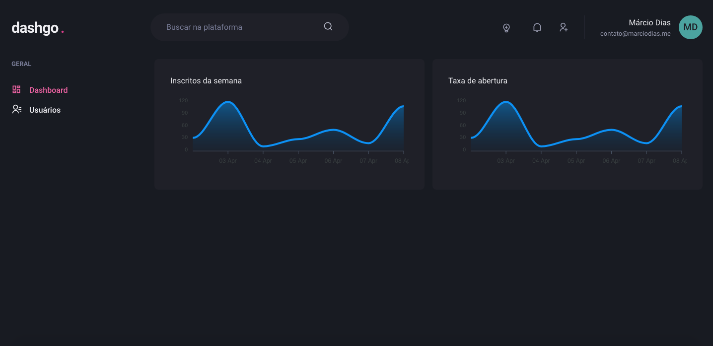

<h1 align="center">
    Dashgo - NextJS + Chakra UI
</h1>

Aplicação template dashboard com NextJS + Chakra UI

---

<h1 align="center">
  
</h1>

---

## Licença

Distribuído sob a licença MIT. Veja [LICENSE](LICENSE) para mais informações.

---

## Autor

Feito por Márcio Dias 👋🏽 Entre em contato!

